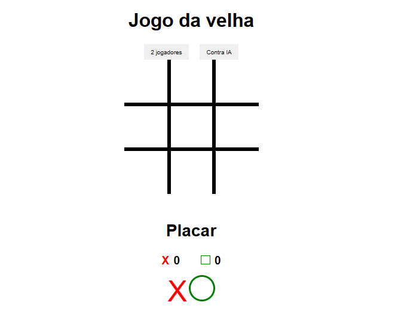

<h1 align="center"> Jogo da velha </h1>

Projeto com objetivo de desenvolver um jogo da velha com JS.

  

 

## :🚀 Tecnologias

Esse projeto foi desenvolvido com as seguintes tecnologias:

- HTML e CSS
-  JS

## 💻 Projeto

Projeto para aprimorar os conhecimento em JS.
